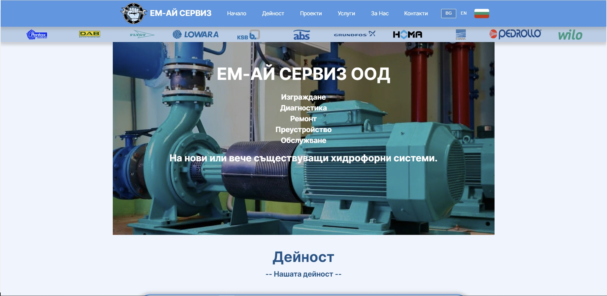

# ЕМ-АЙ СЕРВИЗ ООД — Static Business Website

> Professional pump repair, hydrophore systems, and maintenance services — Varna, Bulgaria.

[](https://ma-service.onrender.com/)
[](LICENSE)


---



---

## About the Project

This is the official website for **ЕМ-АЙ СЕРВИЗ ООД** (EM-AI Serviz OOD), a Bulgarian company founded in **2017**, specializing in the service, repair, and installation of pump systems and hydrophore equipment.

The site is a **bilingual (BG / EN) single-page static website** presenting the company's services, completed projects, and contact information.

---

## Services

| Service | Description |
|---|---|
| **Construction** | Building new hydrophore and pump systems for residential and industrial use |
| **Diagnostics** | Identifying and diagnosing faults in pumps and pump equipment |
| **Repair** | Full repair of pumps, electric motors, electric control panels, and pool pumps |
| **Upgrade / Renovation** | Retrofitting and improving existing systems |
| **Maintenance** | Ongoing servicing of hydrophore and pump systems using quality consumables |
| **Parts Supply** | Access to a wide network of suppliers for all types of spare parts |
| **Electric Motors** | Rewinding and repair of asynchronous electric motors |
| **Electric Panels** | Repair and service of all types of electrical control panels |

---

## Completed Projects

The website showcases a portfolio of real-world projects, including:

- New domestic & industrial hydrophore systems
- Sewage pump station installations (Grundfos)
- Wastewater system upgrades (FAGGIOLATI coupling systems)
- Repair of sewage pumps — Grundfos SEV 80.80.110 (11 kW)
- Repair of industrial pumps — Wilo EMU 25 kW & 2.2 kW (stator rewinding, bearings, seals)
- Firefighting system overhaul — WILO 90 kW electric motor + 6-cylinder diesel engine
- Industrial pump repairs — KSB pumps (160 kW motor)
- Hydraulic cylinder full revision and hose replacement
- New impeller wheel manufacturing for worn pumps
- Pressure boosting systems for water supply networks
- Grundfos mixer repair (stator rewinding + bearing replacement)
- Hydrophore systems with UV disinfection and water softening

---

## Partner Brands

The company collaborates with leading American, Japanese, Korean, and European manufacturers:

`Grundfos` &nbsp; `Wilo` &nbsp; `KSB` &nbsp; `Ebara` &nbsp; `Flygt` &nbsp; `Lowara` &nbsp; `Homa` &nbsp; `Pedrollo` &nbsp; `Pentax` &nbsp; `DAB` &nbsp; `ABS`

---

## Tech Stack

| Technology | Purpose |
|---|---|
| **HTML5** | Single-page structure with BG/EN language sections |
| **CSS3** | Custom responsive styles (`static/styles.css`) |
| **JavaScript (Vanilla)** | Language switching, image modal, navigation (`static/app.js`) |
| **EmailJS** | Client-side contact form email sending (`static/emails.js`) |
| **Owl Carousel** | Image sliders for the project gallery |
| **Font Awesome 6** | Icons throughout the UI |

---

## Project Structure

```
PumpsRepairAndMaintenance/
├── index.html                  # Main single-page application
├── static/
│   ├── styles.css              # All custom styles
│   ├── app.js                  # Language switching, modal, nav logic
│   ├── emails.js               # EmailJS contact form integration
│   ├── Lib/                    # Third-party libraries (Owl Carousel)
│   └── images/
│       ├── logos/              # Company logo & favicon
│       ├── banner/             # Partner brand logos
│       ├── services.png        # Services section image
│       └── our_work/           # Project photo galleries
├── resources/                  # Additional assets
├── readme_images/              # Images used in this README
└── LICENSE
```

---

## Running Locally

No build tools required. Simply open the file in a browser:

```bash
# Option 1 — open directly
open index.html

# Option 2 — serve with Python
python3 -m http.server 8080
# then visit http://localhost:8080
```

---

## Contact

| | |
|---|---|
| **Phone / Viber** | +359 883 30 84 63 |
| **Email** | m-aservice@mail.bg |
| **Address** | гр. Варна, ул. Девня 104, Bulgaria |
| **Facebook** | [Ремонт На Помпи](https://www.facebook.com/people/%D0%A0%D0%B5%D0%BC%D0%BE%D0%BD%D1%82-%D0%9D%D0%B0-%D0%9F%D0%BE%D0%BC%D0%BF%D0%B8-%D0%A5%D0%B8%D0%B4%D1%80%D0%BE%D1%84%D0%BE%D1%80%D0%B8%D0%94%D1%80%D0%B5%D0%BD%D0%B0%D0%B6%D0%BD%D0%B8-%D0%9F%D0%BE%D0%BC%D0%BF%D0%B8/100054319009841/) |
| **Live Site** | [ma-service.onrender.com](https://ma-service.onrender.com/) |

---

## License

This project is licensed under the [MIT License](LICENSE).